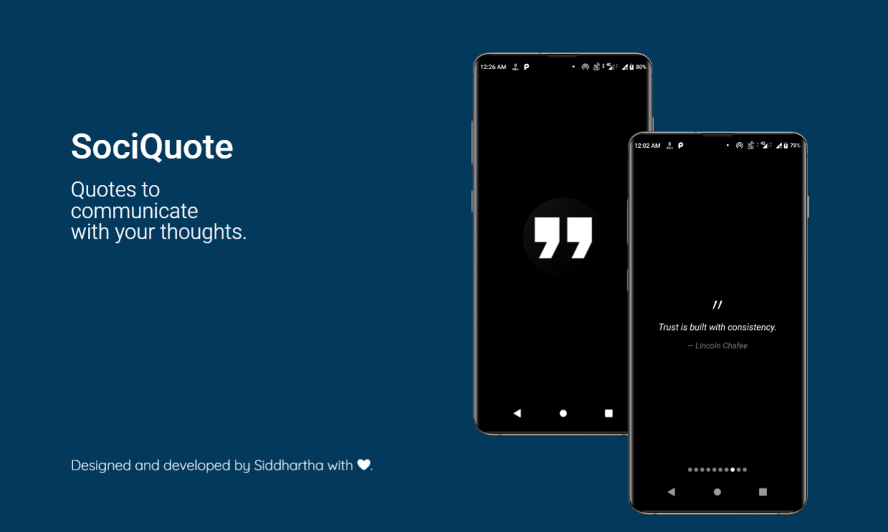

#  SociQuote

A open source quotes app made possible by [quotable open source API](https://github.com/lukePeavey/quotable) and [React Native](https://reactnative.dev/).

## Status

## Download

[Download from Github](https://github.com/siddsarkar/SociQuote/releases) to grab the latest apk.

## Features

- [x] Pull to refresh
- [x] Longpress for sharing

## Design

## License

[MIT](https://github.com/siddsarkar/SociQuote/blob/main/LICENSE)

## Todos

- [x] Custom loader
- [ ] Add share options(to ui element)
